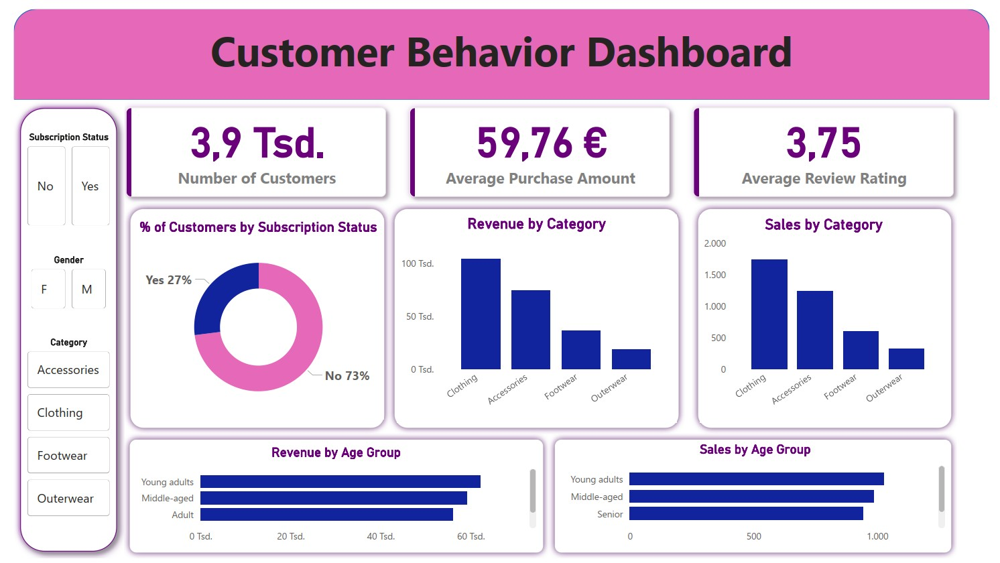

# Customer Shopping Behavior Analysis Dashboard

## Project Overview

This project analyzes customer shopping behavior using Python, SQL, and Power BI.  
The goal is to understand customer segments, revenue trends, gender distribution, purchase behavior, and product category performance.

## Tools Used

## Dashboard Overview

